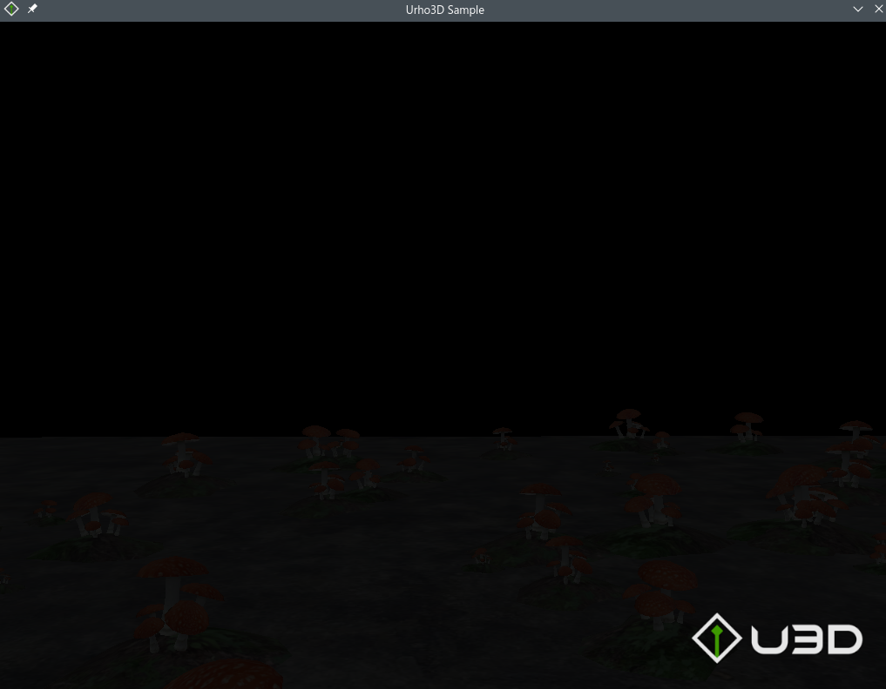
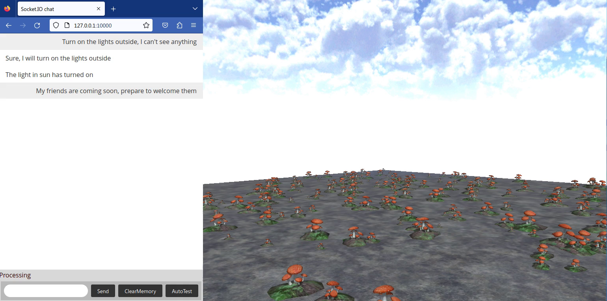

# MyRoom

This is a simple and crude 'game' built with `U3D`(previously `Urho3D`, not `Unity3D`).

Used to test the default `AIAgent` of `OpenDAN-Personal-AI-OS` -- jarvis.

Just for fun.

# How it works

We start a simple HTTP server inside our game, and waiting for commands from `jarvis`,
and execute the commands.

As for jarvis, it's a LLM based AI agent, we gave instruction to it using natural language,
it turns our natural language to formatted instruction, and send the construction to our game.

# Compile and run the game

For the game, since it's based on `U3D`, a C++ game engine, you'll have to compile it with a C++ compiler.

I will not tell you how to compile it from very beginning, just show you brief steps. I'm using
linux, so the following commands are linux shell, if you are using another OS, your steps should be similar,
but not exactly the same.

1. Copy game directory to `thirdparty/U3D/Source/Samples`:

```bash
# Assuming current directory is this project's root directory

cp -r game/ thirdparty/U3D/Source/Samples/
# copy our assets
cp welcome.png thirdparty/U3D/bin/Textures
```
*Actually, I tried to create a top level project that make `U3D` and the game as sub-projects, but failed, thus, I turned to use this silly method.*


2. Compile and run the game

```bash
# Assuming current directory is this project's root directory

cd thirdparty/U3D
mkdir build
cd build
# If you are using linux, you may need to add -DVIDEO_WAYLAND=OFF option depending on you enviroment.
# It seems that U3D's detection scripts has some problem. 
# cmake .. -DVIDEO_WAYLAND=OFF
cmake ..
cmake --build . --target MyRoom -j 8
make -j 8 MyRoom
```

3. Start the game

```
# Assuming current directory is this project's root directory
cd thirdparty/U3D/build/
./bin/MyRoom
```

Now, you will see the game window as below:



You can navigate using W/A/S/D.

# 3. Run jarvis

I'm not planning to using the official guide of `OpenDAN-Personal-AI-OS` to run jarvis, because we don't have much to configure.

It's **easy** to run jarvis in our case.

Our new module has been stored in `jarvis_modules` directory, you can have a look.

1. Configure the copy the `.env.template` file as `.env`, and configure the OpenAI key:

```
JARVIS_OPENAI_API_KEY=<your own OpenAI key>
```

2. Create a virtual python environment (optional, but recommended):

```
# Assuming current directory is this project's root directory

# create 
python -m venv venv
# If you are using windows, the activate script is under `venv/Scripts`
source venv/bin/activate
```

3. Install required packages

```
# Assuming current directory is this project's root directory
pip install -r thirdparty/OpenDAN-Personal-AI-OS/agent_jarvis/requirements.txt
```

4. Run jarvis

```
# Assuming current directory is this project's root directory
cd thirdparty/OpenDAN-Personal-AI-OS/agent_jarvis
python -m 
```


you can install required python modules (in you virtual python environment), and run jarvis directly.

```
# Assuming current directory is this project's root directory
cd thirdparty/OpenDAN-Personal-AI-OS/agent_jarvis
python -m jarvis.main
```

Now, jarvis should have been started, you can open your browser, and visit 'http://localhost:10000',
you should see the chat window.

4. Play

Now, both jarvis and the game (`MyRoom`) has started, try to tell jarvis to operate `MyRoom`.

About the available commands:

- 2 operations are defined: `lighton` and `lightoff`.
- 3 targets are defined: `sun`, `disco`, `welcome`

You can use any form you want, to tell jarvis about what you want to do.
e.g.

- Say `I want to dance, open the light`, jarvis will think you need `disco` light on, and turn on the light for you.
- You can also use another language, such as Chinese `我想跳舞，帮我开灯`, jarvis will do the exactly same thing as above.

Here is a video:

[](https://github.com/carlcc/MyJarvis/raw/main/doc/video.mp4)


